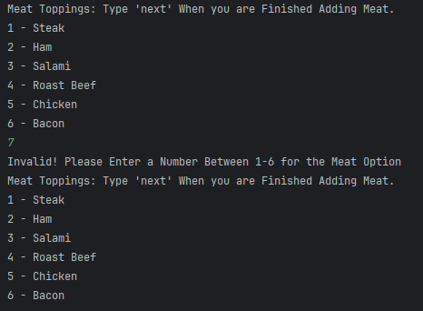

# Financial Tracker - Brandon Morse

## The Deli-cious Deli is an Application that Allows a customer to buy sandwiches, chips and drinks and checkout their order and receive a receipt just as they would in an in-person Deli.

## User Stories

- As a user, I don't want to type in each ingredient by name so that my process is faster

- As a user, I want to cancel my order at any time so that if I change my mind I do not have to go through the remaining menus.

- As a user, I want to complete my order at any time after adding the main ingredients so that I don't have to go through menus for items I don't want

- As a user, I want to see my receipt before confirming my order so that I can catch any mistakes I may have made

- As a user, I want to see the available ingredients when going through menus so that my process is faster

## Setup

1. Create the Sandwich, Chips and Drink classes to store information such as product sizes and prices
2. Create the Topping Abstract class to be overridden by the methods of the Meat, Cheese, Sauces and Regular Toppings derived classes.
3. Create the UserInterface class which includes user options and while loops with try catches for handling user input.
4. Create the OrderFileManager class that creates the receipts and stores the customer order information including total prices.
5. Create the Order class that handles adding the lists together to calculate the total price for OrderFileManager.
6. Create the MainProgram that runs the Application

### Prerequisites

- IntelliJ IDEA: Ensure you have IntelliJ IDEA installed, which you can download from [here](https://www.jetbrains.com/idea/download/).
- Java SDK: Make sure Java SDK is installed and configured in IntelliJ.

### Running the Application in IntelliJ

Follow these steps to get your Financial Tracker Application running within IntelliJ IDEA:

1. Open IntelliJ IDEA.
2. Select "Open" and navigate to the directory where you cloned or downloaded the project.
3. After the project opens, wait for IntelliJ to index the files and set up the project.
4. Find the main class with the `public static void main(String[] args)` method.
5. Right-click on the file and select 'Run 'YourMainClassName.main()'' to start the application.

## Technologies Used

- IntelliJ (Amazon Corretto 17.0.14)

## Demo

## Future Work

- Menu for the Customer to Input their Name to have a Personalized Receipt to be Added in the Future!

## Resources

- [W3 Schools for Documentation ](https://www.w3schools.com/java/ref_string_format.asp)
- [Potato Sensei](https://chatgpt.com/g/g-681d378b0c90819197b16e49abe384ec-potato-sensei/c/681df9fb-4e10-800e-948a-52c7b9de4f9d)

## Team Members

- **Brandon Morse** - Application Development (Method, constructor, getters and setters creation)

## Thanks!

- Thank you to Mr. Raymond for continuous support and guidance!
